# MRO Data Platform on Databricks

A synthetic **Maintenance, Repair and Operations (MRO)** data platform built to exercise realistic data-engineering patterns on Databricks.

The project does more than generate random rows. It simulates an operational MRO environment with causally related maintenance, inventory, purchasing, receiving, fiscal, and accounts-payable workflows, persists that operational state in Delta Lake, and exposes it to an independently scheduled Bronze → Silver → Gold → Semantic analytical pipeline.

The repository is also a **Job-as-Code** example: the operational simulator and analytical pipeline are deployed as two independent Databricks Jobs from the same Declarative Automation Bundle. Their integration contract is persisted Delta state plus the Bronze checkpoint—not an orchestration dependency.

---

## What this project demonstrates

The project is intentionally designed as a compact laboratory for several data-platform concepts:

- stateful synthetic operational-data generation;
- incremental ingestion using per-table Delta CDF checkpoints;
- Delta Lake state and event persistence;
- retry-friendly deterministic simulation;
- medallion architecture responsibilities;
- domain-oriented Silver transformations;
- dimensional modeling in Gold;
- Unity Catalog metric views as a semantic layer;
- Databricks multi-task Jobs and DAG dependencies;
- quality gates that can fail the workflow when business invariants are broken;
- Declarative Automation Bundles for Job-as-Code deployment.

It is useful for experimenting with Databricks Jobs, Delta Lake, dimensional modeling, semantic modeling, process mining, data-quality checks, and downstream BI/AI consumers without requiring access to a real ERP.

---

## Business context

The simulated company operates industrial assets and needs to coordinate three strongly related MRO areas:

1. **Maintenance and inventory / warehouse operations**
2. **Procurement and receiving**
3. **Fiscal and accounts payable**

These domains are intentionally connected.

A typical simulated business flow is:

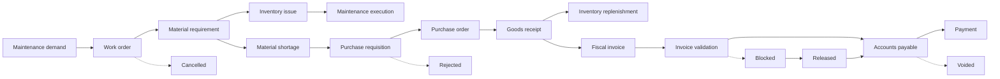

The resulting data therefore contains useful causal relationships rather than independent synthetic records.

---

<details>
<summary><strong>Repository structure and asset inventory</strong></summary>

## Repository structure

The source tree follows the same architectural boundaries as the platform:

```text
.
├── .github/
│   └── workflows/
│       ├── ci.yml
│       └── cd.yml
├── databricks.yml
├── README.md
├── requirements-ci.txt
├── resources/
│   ├── mro_simulator.job.yml
│   ├── mro_analytics.job.yml
│   └── mro_genie.yml
├── scripts/
│   └── cd/
│       └── blue_green.sh
├── tests/
│   └── architecture/
│       ├── conftest.py
│       ├── test_bundle.py
│       ├── test_job_graph.py
│       ├── test_layer_boundaries.py
│       ├── test_semantic_coverage.py
│       ├── test_schema_evolution.py
│       ├── test_platform_hardening.py
│       └── test_workflows.py
└── src/
    ├── operational/
    │   └── 01_simulate_mro.py
    │
    ├── data_engineering/
    │   ├── 02_bronze_ingest.py
    │   ├── 03_silver_master.py
    │   ├── 04_silver_mro.py
    │   ├── 04_silver_stock.py
    │   ├── 04_silver_procurement.py
    │   ├── 04_silver_finance.py
    │   ├── 05_gold_dimensions.py
    │   ├── 06_gold_mro.py
    │   ├── 06_gold_stock.py
    │   ├── 06_gold_procurement.py
    │   ├── 06_gold_finance.py
    │   └── 08_quality_gate.py
    │
    └── analytics/
        ├── 07_semantic_model.py
        └── 09_process_mining.py
```

The directory boundaries are intentional:

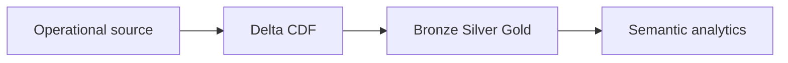

There is no direct Job dependency between `operational` and `data_engineering`. The analytical side observes independently committed source changes through Delta Change Data Feed.

### Asset inventory

| Asset | Responsibility |
|---|---|
| `databricks.yml` | Bundle root configuration. Defines the platform bundle and reusable catalog/schema variables. |
| `resources/mro_simulator.job.yml` | Independent operational simulation Job and its simulator-specific schedule/parameters. |
| `resources/mro_analytics.job.yml` | Analytical Job: Bronze → Silver → Gold → Semantic + Process Mining → Expectations → Observability → quality gate. |
| `resources/mro_genie.yml` | Managed Genie space over the ten governed metric views. |
| `src/operational/01_simulate_mro.py` | Stateful synthetic MRO source-system simulator backed by Delta tables. |
| `src/data_engineering/02_bronze_ingest.py` | Incremental Delta CDF ingestion with analytics-owned per-table commit checkpoints. |
| `src/data_engineering/03_silver_master.py` | Conforms supplier, material, asset, warehouse, and cost-center master data. |
| `src/data_engineering/04_silver_mro.py` | Maintenance lifecycle normalization and enrichment. |
| `src/data_engineering/04_silver_stock.py` | Inventory movement and stock-position normalization. |
| `src/data_engineering/04_silver_procurement.py` | Procurement and receiving normalization/enrichment. |
| `src/data_engineering/04_silver_finance.py` | Fiscal, AP, and payment normalization/enrichment. |
| `src/data_engineering/05_gold_dimensions.py` | Conformed dimensions; supplier, material, and asset use SCD Type 2. |
| `src/data_engineering/06_gold_mro.py` | Maintenance facts. |
| `src/data_engineering/06_gold_stock.py` | Inventory facts. |
| `src/data_engineering/06_gold_procurement.py` | Procurement and receiving facts. |
| `src/data_engineering/06_gold_finance.py` | Fiscal and financial facts. |
| `src/analytics/07_semantic_model.py` | Ten governed analytical cubes over the ten Gold facts. |
| `src/analytics/09_process_mining.py` | Process-event, case, and transition models over `entity_state_transition`. |
| `src/data_engineering/08_expectations.py` | Declarative data-quality rule catalog and generic expectation runner. |
| `src/data_engineering/09_observability.py` | Row-count and Delta freshness observations persisted in the ops schema. |
| `src/data_engineering/08_quality_gate.py` | Cross-layer publication contract, including semantic fact/cube coverage. |
| `.github/workflows/ci.yml` | Credential-free Python, YAML, Bash, architectural, and schema-evolution validation. |
| `.github/workflows/cd.yml` | DEV ephemeral validation plus PROD blue-green delivery with isolated catalog integration tests. |
| `scripts/cd/blue_green.sh` | PROD-only blue-green discovery, cutover, and rollback helper. |
| `tests/architecture/` | Executable architectural contracts for bundle structure, layer boundaries, Job DAGs, and semantic coverage. |
| `requirements-ci.txt` | Minimal Python dependencies used by GitHub Actions. |
---

</details>

<details>
<summary><strong>Databricks catalog layout and layer ownership</strong></summary>

## Databricks catalog layout

The default catalog is:

```text
mro-data
```

Because the catalog contains a hyphen, SQL references must quote it with backticks:

```sql
SELECT *
FROM `mro-data`.gold.fact_work_order;
```

The notebooks already centralize identifier quoting, so the hyphenated catalog name is supported.

The project creates or uses six schemas:

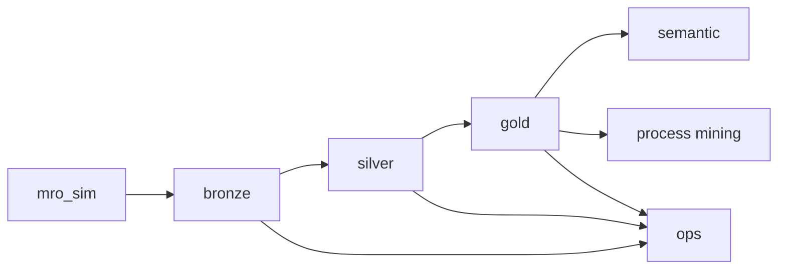

The diagram deliberately keeps node labels simple for broad Mermaid-renderer compatibility. The ownership is:

- `mro_sim` — synthetic operational source;
- `bronze → silver → gold` — data-engineering layers;
- `semantic` — governed analytical cubes;
- `ops` — persisted expectation and observability results.

### Layer responsibilities

| Layer | Primary responsibility | What should *not* happen here |
|---|---|---|
| `mro_sim` | Simulate source-system behavior and persist operational state/events. | Analytical modeling. |
| Bronze | Preserve source history and ingestion metadata with minimal interpretation. | KPI logic, dimensional modeling, cross-domain business enrichment. |
| Silver | Normalize, validate, conform, and enrich operational-domain data. | Dashboard-specific metrics or arbitrary presentation aggregates. |
| Gold | Publish conformed dimensions and facts at explicit analytical grains. | Re-implement source-system state machines. |
| Semantic | Define reusable business measures and dimensions over Gold. | Duplicate transformation logic that belongs in Silver/Gold. |

---

</details>

<details>
<summary><strong>1. Operational source simulator</strong></summary>

# 1. Operational source simulator — `src/operational/01_simulate_mro.py`

The simulator is the source system for the rest of the project. It is intentionally **job-oriented**, not a continuously running service.

Every invocation:

1. loads durable simulation state from Delta;
2. advances one or more logical simulation ticks;
3. generates operational state transitions and events;
4. persists a micro-batch;
5. advances `sim_state.committed_tick` only after the batch is durable;
6. exits.

This means ephemeral Databricks Job compute is safe: the driver can disappear after a successful run because the state needed for the next run is stored in Delta.

## Simulation clock

The important control table is:

```text
mro_sim.sim_state
```

Its main concepts are:

- `simulated_at` — current business/simulation time;
- `committed_tick` — highest fully persisted logical tick;
- `seed` — deterministic random seed;
- `step_minutes` — simulated time advanced per tick;
- `business_timezone` — timezone used for business-calendar behavior.

Example:

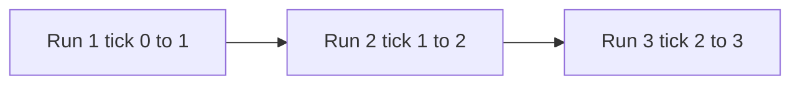

With:

```text
step_minutes = 60
```

one tick represents one simulated hour.

## Why `committed_tick` still exists

`committed_tick` remains useful **inside the operational simulator**. It is a private recovery and deterministic-generation checkpoint.

The analytical platform deliberately does **not** consume that tick.

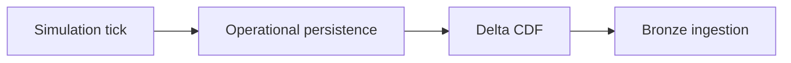

The simulator may know a globally consistent logical step; downstream analytics behaves like an external consumer and only observes independently committed source changes.
## Determinism and retries

The simulator uses deterministic IDs and a per-tick random seed derived from the configured seed and tick number.

Conceptually:

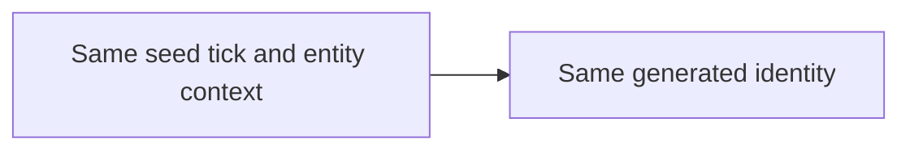

This makes replay/retry behavior substantially safer than generating new random identifiers on every Job attempt.

## Exception-path simulation

The simulator intentionally produces a small number of non-happy outcomes so exception handling is represented in the data, not only in the diagrams.

Current default exception rates are encoded in `EXCEPTION_RATES` inside `01_simulate_mro.py`:

| Exception | Default rate | Result |
|---|---:|---|
| Work order withdrawn before release | 2% | `work_order → CANCELLED`, with outstanding material demand cancelled |
| Requisition rejected at approval | 3% | `purchase_requisition → REJECTED` |
| Supplier cancels before first PO receipt | 2% | `purchase_order → CANCELLED` and linked requisition → `CANCELLED` |
| AP title reversed | 1% deterministic cohort | `accounts_payable → VOIDED` |

Fiscal exceptions are generated from price/tax discrepancies rather than a single generic rate and follow `VALIDATING → BLOCKED → RELEASED`.

These rates are deliberately low: the primary flow remains dominant, while the analytical layers still receive enough exception cases to validate lifecycle logic and exception-oriented KPIs.

## Operational domains

The simulator maintains master/reference data for:

- suppliers;
- warehouses;
- cost centers;
- assets;
- materials;
- asset/material usage profiles.

It generates transactional behavior for:

- maintenance work orders;
- work-order material demand;
- inventory issues and receipts;
- stock replenishment;
- purchase requisitions;
- purchase orders;
- partial goods receipts;
- fiscal invoices;
- invoice validation and blocking;
- accounts payable;
- payment scheduling and execution;
- cycle-count adjustments.

## Stateful workflows

Each workflow has both a **normal completion path** and an explicit **business escape path**. Escape states are terminal and auditable rather than leaving an entity indefinitely parked in an intermediate state.

The exception semantics are domain-specific:

- maintenance demand can be `CANCELLED`;
- material demand can be `CANCELLED` when the parent work order is withdrawn;
- requisitions can be `REJECTED` or `CANCELLED`;
- purchase orders can be `CANCELLED`;
- fiscal validation uses `BLOCKED → RELEASED` as its unhappy-but-resolved route and still has only the two terminal outcomes `POSTED` and `RELEASED`;
- accounts-payable titles can be `VOIDED`.

### Work order

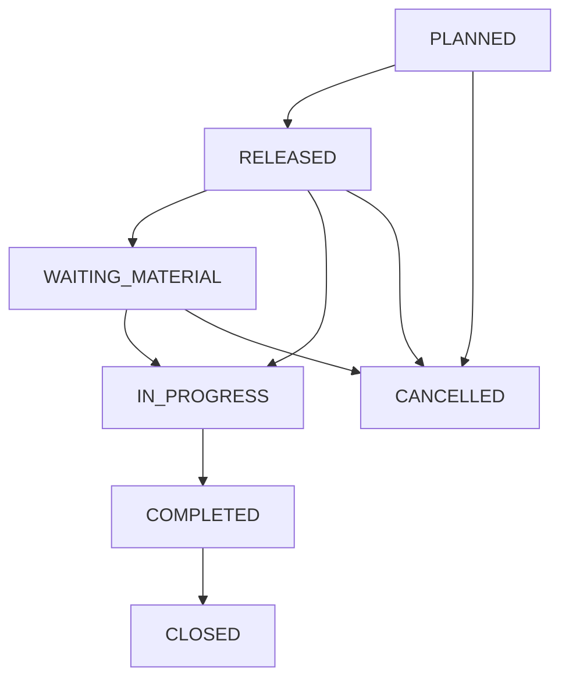

### Work-order material

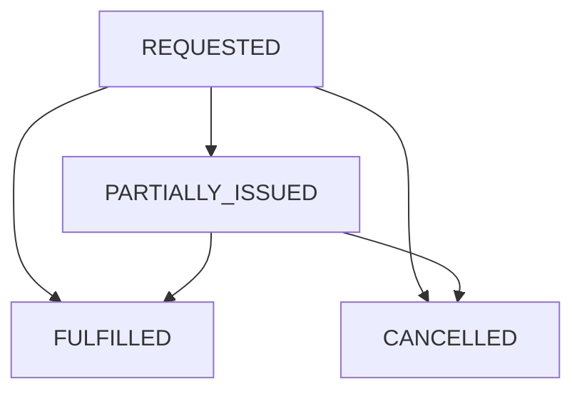

### Purchase requisition

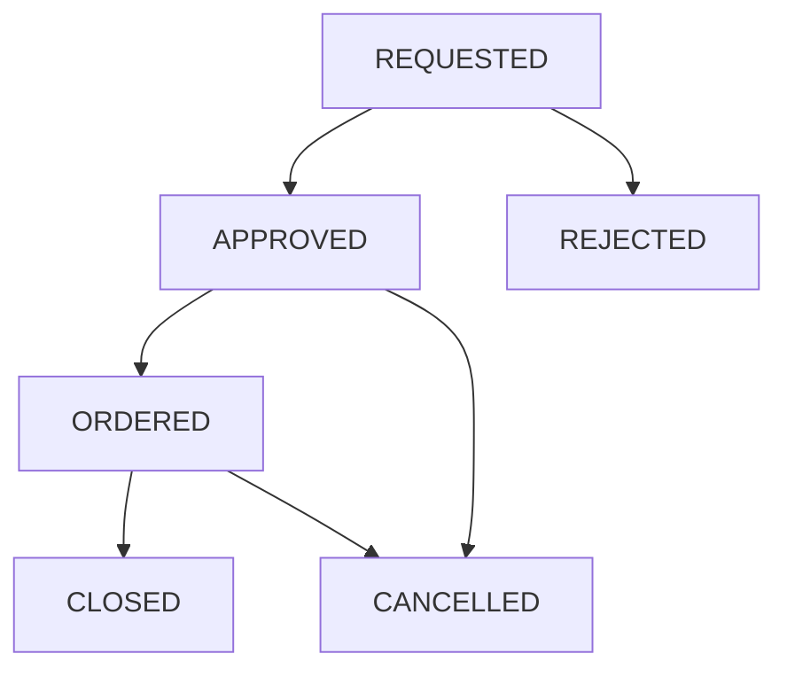

### Purchase order

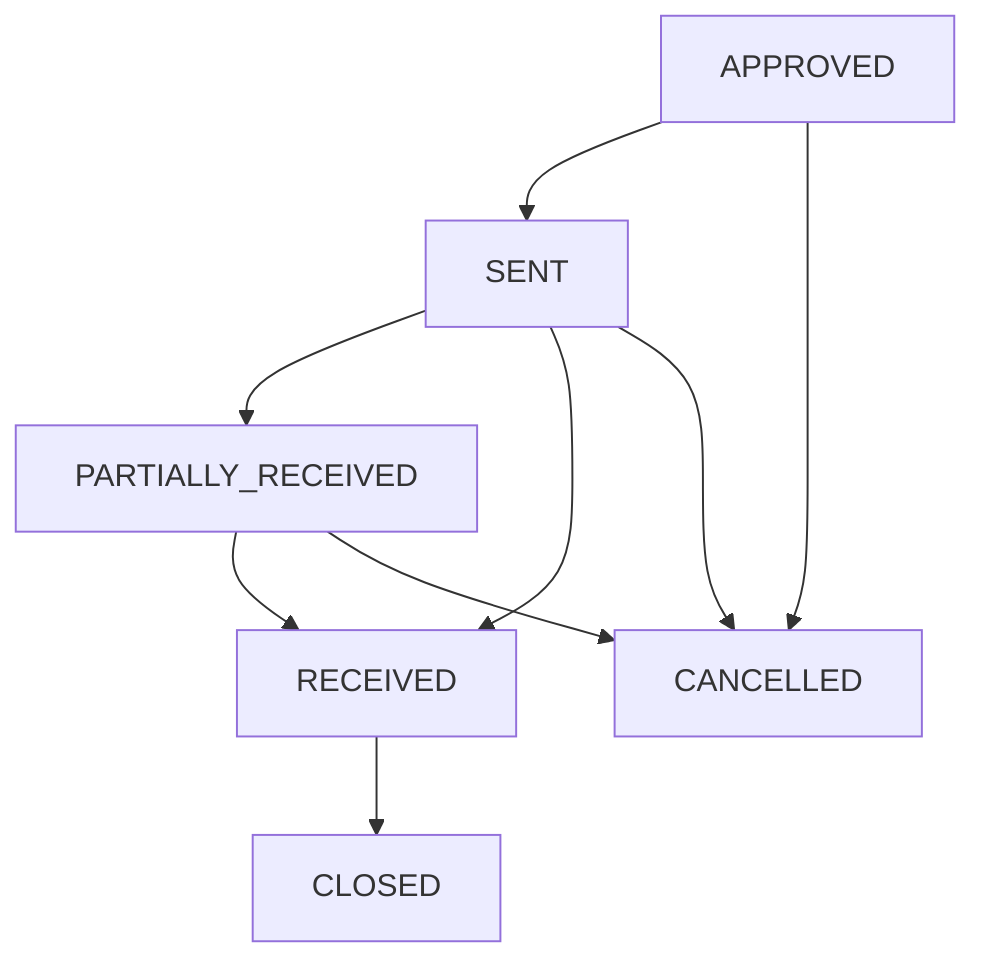

A PO may receive multiple partial receipts before becoming fully received.

### Fiscal invoice

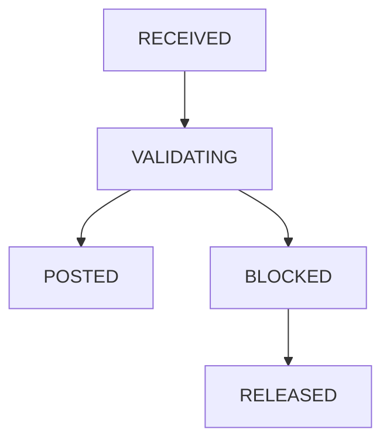

`POSTED` and `RELEASED` are the two terminal fiscal outcomes. `POSTED` represents the straight-through path, while `RELEASED` represents an invoice that was blocked and subsequently cleared through exception handling. Both outcomes may create an accounts-payable item; AP is a downstream financial workflow rather than another fiscal-invoice state.

### Accounts payable

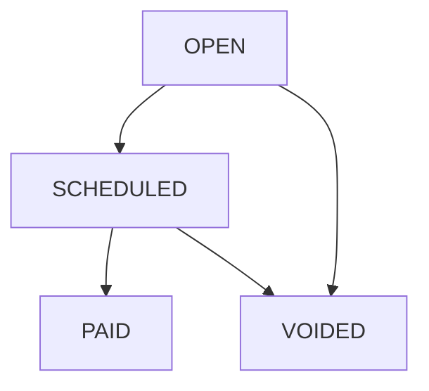

## Physical source tables

The simulator distinguishes mutable state from immutable events.

### Master/reference tables

```text
supplier
warehouse
cost_center
asset
material
asset_material_profile
```

### Private simulation control

```text
sim_state
simulation_run
```

These are operational implementation details. They are **not ingested by Bronze** and do not participate in the analytical source contract.

### Versioned mutable state

```text
stock_balance_state
work_order_state
work_order_material_state
purchase_requisition_state
purchase_order_state
purchase_order_item_state
fiscal_invoice_state
accounts_payable_state
```

Versioned rows use `valid_from_tick`.

### Append/event stores

```text
purchase_requisition_item_store
goods_receipt_store
goods_receipt_item_store
inventory_movement_store
fiscal_invoice_item_store
payment_store
entity_state_transition_store
event_log_store
```

### Source-facing views

The simulator also exposes current committed views such as:

```text
stock_balance
work_order
work_order_material
purchase_requisition
purchase_order
purchase_order_item
fiscal_invoice
accounts_payable
```

and committed event views such as:

```text
inventory_movement
goods_receipt
payment
entity_state_transition
event_log
```

State-history views are also generated for versioned entities.

---

</details>

<details>
<summary><strong>2. Bronze CDC ingestion</strong></summary>

# 2. Bronze ingestion — `src/data_engineering/02_bronze_ingest.py`

Bronze is a **CDC boundary**, not an extension of the simulator.

It asks:

> Which independently committed source changes has analytics observed?

It does **not** ask which simulation tick is globally complete.

## Source interface

Operational Delta tables expose Change Data Feed. Bronze publishes source-side commit metadata as:

```text
_source_change_type
_source_commit_version
_source_commit_timestamp
_bronze_ingested_at
_bronze_run_id
_source_table
_source_record_hash
```

The simulator-private sequencing columns `valid_from_tick` and `simulation_tick` are removed at the Bronze boundary. `sim_state` and `simulation_run` are not ingested.

## Per-table checkpoints

Bronze persists `bronze.ingestion_checkpoint` with one independent position per source table:

```text
source_table
last_commit_version
last_commit_timestamp
updated_at
```

There is intentionally no global analytical watermark.

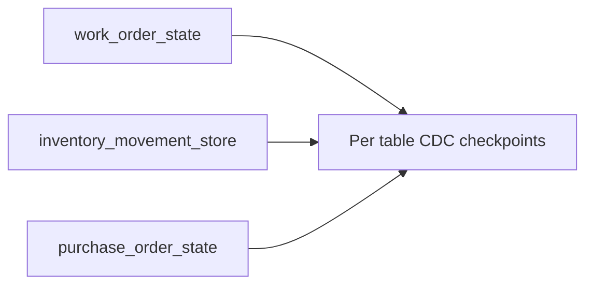

## Stability lag

The analytical Job defaults to:

```text
source_stability_lag_minutes = 5
```

Bronze only consumes commits older than `analytics_start_time - stability_lag`. This reduces the chance of observing a cross-table business action while it is still being persisted, but it is **not** an atomicity guarantee.

## Initial baseline

On first observation:

- master/reference tables are snapshotted at the latest stable Delta version;
- state tables publish the latest visible state per business key;
- append/event tables publish their stable history.

That version becomes the first checkpoint. Subsequent runs consume CDF from `last_commit_version + 1` through the latest stable version.

## Three notions of time

The analytical model distinguishes:

```text
business/event time
source commit time
analytics ingestion time
```

For example:

```text
occurred_at                 = 14:02
_source_commit_timestamp    = 14:02:05
_bronze_ingested_at         = 14:08
```

This allows ingestion-latency and late-arrival analysis without exposing simulator sequencing.

## Analytical data horizon

Bronze derives `data_horizon_at` from the latest observed business event and stores it in `bronze.ingestion_run`. Silver uses that observed horizon for open lifecycle durations and overdue calculations. It is not an ingestion watermark and does not claim global completeness.

## Eventual consistency

Temporary cross-table inconsistency is allowed. Bronze preserves what it observed instead of inventing cross-table atomicity.

The quality gate distinguishes hard structural invariants from cross-entity reconciliation invariants. Cross-entity mismatches become fatal only after:

```text
reconciliation_failure_threshold = 3
```

consecutive analytical runs by default.

## Bronze control objects

```text
ingestion_checkpoint
ingestion_run
reconciliation_check_state
```

Bronze remains the CDC ingestion boundary. Selected Silver and Gold models publish incrementally with Delta `MERGE`, while models that benefit from deterministic recomputation can remain rebuild-oriented.
---

</details>

<details>
<summary><strong>3. Silver conformed layer</strong></summary>

# 3. Silver layer

Silver is organized by business domain.

Its responsibilities include:

- type normalization;
- monetary conversion from cents into decimal currency units;
- tax-rate normalization from basis points into percentages;
- reference joins;
- lifecycle enrichment;
- fulfillment and lead-time calculations;
- referential-integrity checks;
- operational data-quality rules.

Silver keeps operational grains rather than collapsing everything into dashboard aggregates.

## `src/data_engineering/03_silver_master.py`

Produces conformed reference entities:

```text
silver.supplier
silver.warehouse
silver.cost_center
silver.material
silver.asset
silver.asset_material_profile
```

Examples of normalization:

```text
5800 cents → 58.00 currency units
1800 basis points → 18.00%
```

The notebook also validates important master-data conditions such as duplicate IDs and missing supplier/cost-center references.

## `src/data_engineering/04_silver_mro.py`

Produces:

```text
silver.work_order_status_history
silver.work_order
silver.work_order_material
silver.work_order_lifecycle
```

Derived lifecycle attributes include:

- planning hours;
- material-wait hours;
- execution hours;
- closure hours;
- total elapsed lifecycle hours;
- material fulfillment ratio;
- estimated issued-material cost;
- whether the work order ever entered `WAITING_MATERIAL`.

This is the main source for maintenance-cycle analysis and for questions such as:

> How much maintenance delay was caused by material availability?

## `src/data_engineering/04_silver_stock.py`

Produces:

```text
silver.inventory_movement
silver.stock_position
```

Enrichment includes:

- movement direction (`IN`, `OUT`, `ZERO`);
- normalized unit cost;
- inventory-movement value;
- material and warehouse context;
- current available quantity;
- reorder information;
- current inventory value.

The notebook rejects negative on-hand or reserved quantities.

## `src/data_engineering/04_silver_procurement.py`

Produces:

```text
silver.purchase_requisition
silver.purchase_requisition_item
silver.purchase_order
silver.purchase_order_item
silver.goods_receipt
silver.goods_receipt_item
```

Derived procurement attributes include:

- requisition approval lead time;
- PO dispatch lead time;
- promised vs. received delivery variance;
- on-time-delivery flag;
- open quantity;
- fill ratio;
- ordered value;
- received value;
- partial-receipt behavior.

The notebook validates that received quantities never exceed ordered quantities.

## `src/data_engineering/04_silver_finance.py`

Produces:

```text
silver.fiscal_invoice
silver.fiscal_invoice_item
silver.accounts_payable
silver.payment
```

Enrichment includes:

- normalized monetary values;
- invoice price variance percentage;
- whether an invoice was ever blocked;
- tax amounts;
- AP days-to-pay;
- overdue status;
- days past due.

---

</details>

<details>
<summary><strong>4. Gold dimensional model</strong></summary>

# 4. Gold dimensional model

Gold switches intentionally from operational modeling to analytical dimensional modeling.

## `src/data_engineering/05_gold_dimensions.py`

Creates the conformed dimensions:

```text
gold.dim_date
gold.dim_supplier
gold.dim_material
gold.dim_warehouse
gold.dim_cost_center
gold.dim_asset
```

Surrogate analytical keys are deterministic `BIGINT` hashes of durable source IDs.

The date dimension follows the simulated business horizon rather than the wall-clock date on which the Databricks Job happens to execute.

## `src/data_engineering/06_gold_mro.py`

Creates:

```text
gold.fact_work_order
gold.fact_work_order_material
```

Primary grains:

```text
fact_work_order          = one row per work order
fact_work_order_material = one row per work-order/material requirement
```

## `src/data_engineering/06_gold_stock.py`

Creates:

```text
gold.fact_inventory_movement
gold.fact_stock_position
```

Primary grains:

```text
fact_inventory_movement = one row per inventory movement
fact_stock_position      = one row per material × warehouse at the current simulation snapshot
```

## `src/data_engineering/06_gold_procurement.py`

Creates:

```text
gold.fact_purchase_order_item
gold.fact_goods_receipt_item
```

Primary grains:

```text
fact_purchase_order_item = one row per purchase-order item
fact_goods_receipt_item  = one row per goods-receipt item
```

The PO-item fact includes useful supplier-performance attributes such as:

- ordered / received quantity;
- fill ratio;
- delivery variance;
- partial receipt;
- on-time-in-full indicator.

## `src/data_engineering/06_gold_finance.py`

Creates:

```text
gold.fact_fiscal_invoice
gold.fact_fiscal_invoice_item
gold.fact_accounts_payable
gold.fact_payment
```

Primary grains remain explicit: invoice, invoice item, payable title, and payment.

---

</details>

<details>
<summary><strong>5. Semantic layer and fact-to-cube coverage</strong></summary>

# 5. Semantic layer — `src/analytics/07_semantic_model.py`

The semantic layer implements **analytical cubes as Unity Catalog metric views**.

The project now enforces a strict semantic-coverage invariant:

> **Every Gold fact table must be the primary source of exactly one analytical cube.**

This is deliberate. A metric view models one fact grain with reusable measures and many-to-one dimension joins. Keeping one primary cube per fact prevents accidental cross-grain fan-out while still exposing every analytical mart to BI, SQL, dashboards, and AI consumers.

## Fact-to-cube coverage

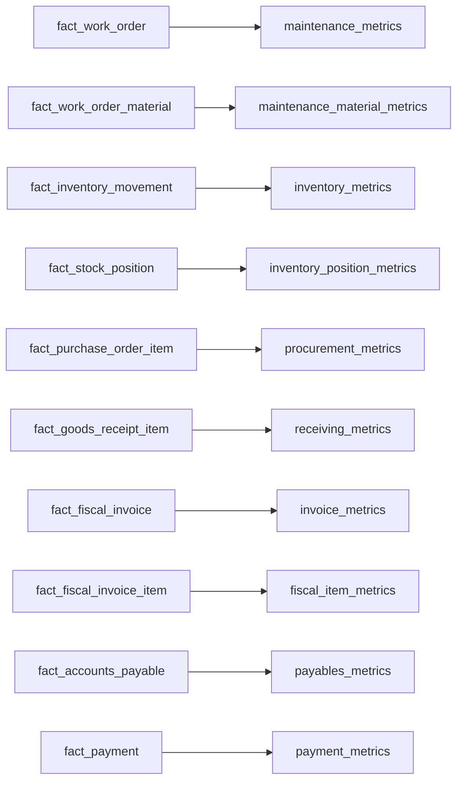

| Gold fact | Primary grain | Analytical cube |
|---|---|---|
| `fact_work_order` | one row per work order | `semantic.maintenance_metrics` |
| `fact_work_order_material` | one row per work-order material requirement | `semantic.maintenance_material_metrics` |
| `fact_inventory_movement` | one row per inventory movement | `semantic.inventory_metrics` |
| `fact_stock_position` | one row per material × warehouse snapshot | `semantic.inventory_position_metrics` |
| `fact_purchase_order_item` | one row per purchase-order item | `semantic.procurement_metrics` |
| `fact_goods_receipt_item` | one row per goods-receipt item | `semantic.receiving_metrics` |
| `fact_fiscal_invoice` | one row per fiscal invoice | `semantic.invoice_metrics` |
| `fact_fiscal_invoice_item` | one row per fiscal invoice item | `semantic.fiscal_item_metrics` |
| `fact_accounts_payable` | one row per payable title | `semantic.payables_metrics` |
| `fact_payment` | one row per executed payment | `semantic.payment_metrics` |

The notebook also publishes:

```text
semantic.cube_registry
```

This ordinary view records `cube_name`, `fact_table`, `domain`, and `grain`. The final quality gate uses it to verify semantic coverage programmatically.

## Maintenance cubes

### `semantic.maintenance_metrics`

Source:

```text
gold.fact_work_order
```

Primary analysis:

- work-order volume and completion;
- preventive/corrective mix;
- cancellations;
- material-wait incidence;
- planning, wait, execution, and total-cycle duration;
- estimated material cost;
- breakdown by date, asset, criticality, cost center, warehouse, priority, and status.

### `semantic.maintenance_material_metrics`

Source:

```text
gold.fact_work_order_material
```

Primary analysis:

- required, issued, and open material quantity;
- quantity fulfillment rate;
- fulfilled / partially issued / cancelled demand lines;
- estimated issued-material cost;
- work-order count affected by material demand;
- breakdown by material, asset, maintenance type, priority, cost center, warehouse, and planned date.

`fact_work_order_material` is enriched in Gold with the relevant work-order dimensional keys so this cube remains a true star-schema model instead of joining one fact directly to another fact.

## Inventory cubes

### `semantic.inventory_metrics`

Source:

```text
gold.fact_inventory_movement
```

Primary analysis:

- receipt and issue quantities;
- net and absolute material flow;
- inventory-movement value;
- cycle-count adjustments;
- breakdown by material, category, criticality, warehouse, movement type, direction, and date.

### `semantic.inventory_position_metrics`

Source:

```text
gold.fact_stock_position
```

Primary analysis:

- on-hand, reserved, and available quantity;
- inventory value;
- positions below reorder point;
- out-of-stock positions;
- current stock availability by material and warehouse.

The current Gold stock-position fact is a **current simulation snapshot**, not yet a historical accumulating snapshot. The cube therefore answers current-position questions; retaining periodic historical snapshots is a future extension.

## Procurement and receiving cubes

### `semantic.procurement_metrics`

Source:

```text
gold.fact_purchase_order_item
```

Primary analysis:

- ordered, received, and open quantity/value;
- fill rate;
- supplier delivery variance;
- late and cancelled orders;
- OTIF count;
- partial receipts;
- breakdown by supplier, material, warehouse, and order date.

### `semantic.receiving_metrics`

Source:

```text
gold.fact_goods_receipt_item
```

Primary analysis:

- receipt count and receipt-line count;
- received quantity;
- receipt value;
- average unit price and receipt value;
- distinct purchase orders received;
- breakdown by supplier, material, warehouse, and receipt date.

## Fiscal cubes

### `semantic.invoice_metrics`

Source:

```text
gold.fact_fiscal_invoice
```

Primary analysis:

- invoice count and value;
- subtotal and tax value;
- `POSTED` vs `RELEASED` terminal outcomes;
- blocked-invoice count/rate;
- tax issues;
- price variance;
- supplier and receipt-date analysis.

### `semantic.fiscal_item_metrics`

Source:

```text
gold.fact_fiscal_invoice_item
```

Primary analysis:

- invoiced quantity and merchandise value;
- ICMS, IPI, PIS, and COFINS amounts;
- total tax amount;
- effective tax rate;
- breakdown by supplier, material, NCM, category, and receipt date.

## Finance cubes

### `semantic.payables_metrics`

Source:

```text
gold.fact_accounts_payable
```

Primary analysis:

- payable exposure;
- open, scheduled, paid, voided, and overdue value;
- payable and void counts;
- average days to pay and days past due;
- supplier, posting-date, and due-date analysis.

`VOIDED` titles are excluded from `open_amount`.

### `semantic.payment_metrics`

Source:

```text
gold.fact_payment
```

Primary analysis:

- payment count;
- number of payable titles settled;
- total cash outflow;
- average and maximum payment value;
- supplier and payment-date analysis.

## Why one primary cube per fact?

Different facts have different grains. For example:

```text
fact_fiscal_invoice      = invoice grain
fact_fiscal_invoice_item = invoice-item grain
```

Combining their measures naively in one star schema can multiply invoice-level values by the number of items. The project therefore keeps a primary metric view at each fact grain and lets consumers choose the cube appropriate to the question.

If a future use case genuinely requires measures from multiple fact grains in one semantic object, it should use an explicit bridge/composable metric-view design rather than an implicit fact-to-fact join.

Metric views require Unity Catalog and a Databricks runtime / SQL environment that supports metric views.
---

</details>

<details>
<summary><strong>6. Quality gate</strong></summary>

# 6. Quality gate — `src/data_engineering/08_quality_gate.py`

The final notebook is deliberately a **hard gate**, not a passive report.

If an invariant fails, the notebook raises an exception and the Job run fails.

Current checks include:

```text
negative_stock
work_order_material_overissue
purchase_order_overreceipt
paid_ap_without_paid_at
orphan_gold_work_order_asset
orphan_gold_inventory_material
duplicate_gold_material_key
watermark_ahead_of_source
semantic_fact_coverage
semantic_cube_coverage
```

This means a green Job run communicates more than "the notebooks executed". It also means the core cross-layer invariants passed.

---

</details>

<details>
<summary><strong>Independent Jobs and execution model</strong></summary>

# Independent Jobs

The Bundle deploys **two independent Jobs**. Neither Job is a task of the other, and there is no `depends_on` relationship between them.

Their integration contract is:

```text
persisted source Delta tables
        +
Delta Change Data Feed
        +
bronze.ingestion_checkpoint
```

The simulator's `committed_tick` remains private operational state and is not an analytical watermark.

This models a real source/analytics boundary: operational activity can continue while analytics is delayed or failing, and analytics can catch up later from the committed source history.

## Operational Job — `mro-source-simulator`

Declared in:

```text
resources/mro_simulator.job.yml
```

The Job contains exactly one task:

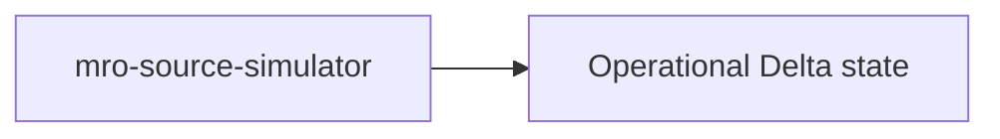

Its default schedule is every **10 minutes**, but the schedule ships paused:

```text
0 0/10 * * * ?
America/Sao_Paulo
pause_status = PAUSED
```

Each run advances the durable operational simulation independently. With the defaults:

```text
step_minutes  = 60
ticks_per_run = 1
```

ten minutes of wall-clock time represent one simulated business hour.

The Job uses:

```text
max_concurrent_runs = 1
queue.enabled       = true
```

because the simulator is a single logical writer advancing one persisted simulation clock.

### Operational Job parameters

| Parameter | Default | Meaning |
|---|---:|---|
| `catalog` | `mro-data` | Unity Catalog catalog. |
| `schema` | `mro_sim` | Operational source schema; populated from bundle variable `source_schema`. |
| `start` | `2026-01-01T08:00:00-03:00` | Initial simulation timestamp. |
| `step_minutes` | `60` | Simulated minutes per tick. |
| `ticks_per_run` | `1` | Ticks advanced per simulator invocation. |
| `commit_every_ticks` | `1` | Maximum ticks between durable flushes. |
| `seed` | `42` | Deterministic base seed. |
| `work_orders_per_day` | `8` | Approximate work-order generation rate. |
| `cycle_counts_per_day` | `3` | Approximate cycle-count rate. |
| `business_timezone` | `America/Sao_Paulo` | Business-calendar timezone. |
| `bootstrap_only` | `false` | Initialize source structures without advancing time. |
| `reset` | `false` | Reset source structures/state before running. Use carefully. |

## Analytical Job — `mro-analytics-pipeline`

Declared in:

```text
resources/mro_analytics.job.yml
```

The analytical DAG begins at Bronze—not at the simulator:

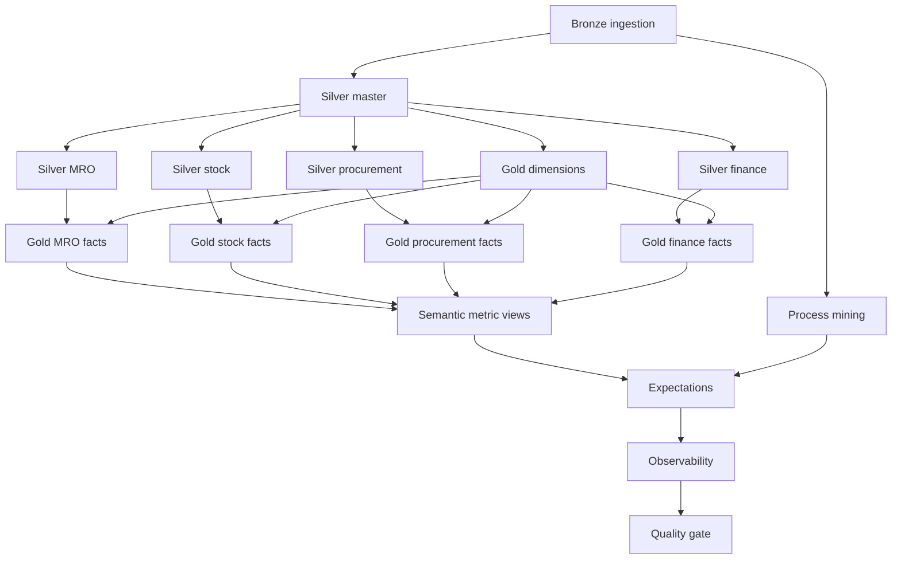

Its default schedule is every **30 minutes**, also paused by default:

```text
0 0/30 * * * ?
America/Sao_Paulo
pause_status = PAUSED
```

At each invocation Bronze advances independent per-table Delta commit checkpoints up to the configured stability cutoff. The analytical Job neither reads nor understands the simulator's logical tick.

### Analytical Job parameters

| Parameter | Default | Meaning |
|---|---:|---|
| `catalog` | `mro-data` | Unity Catalog catalog containing all project schemas. |
| `source_schema` | `mro_sim` | Operational source schema. |
| `bronze_schema` | `bronze` | Incremental ingestion schema. |
| `silver_schema` | `silver` | Normalized/enriched domain schema. |
| `gold_schema` | `gold` | Dimensional analytical schema. |
| `semantic_schema` | `semantic` | Governed metric-view schema. |
| `source_stability_lag_minutes` | `5` | Delay before source commits become eligible for Bronze ingestion. |
| `reconciliation_failure_threshold` | `3` | Consecutive runs before a transient cross-entity mismatch becomes fatal. |

The analytical Job also uses:

```text
max_concurrent_runs = 1
queue.enabled       = true
```

to avoid overlapping rebuilds and competing publication attempts.

## Decoupled execution example

The operational and analytical Jobs have no orchestration dependency. Analytics only observes source commits that are available through Delta Change Data Feed.

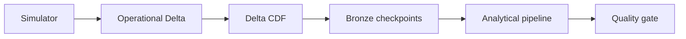

A failed analytical run therefore does not stop operational generation, and analytics never needs to know the simulator's logical tick.
---

</details>

<details>
<summary><strong>Bundle targets and environment isolation</strong></summary>

# Bundle configuration — `databricks.yml`

The platform has **two deployment environments with different lifecycles**:

| Environment | Branch | Bundle target(s) | Data lifecycle | Runtime behavior |
|---|---|---|---|---|
| DEV | `dev` | `dev` | ephemeral integration catalog | validation only; schedules remain paused |
| PROD | `main` | `prod_blue`, `prod_green` | persistent `mro_prod` catalog | blue-green operational runtime |

DEV deliberately has no blue-green slots. A push to `dev` deploys the single `dev` target, validates the complete platform against a disposable Unity Catalog catalog, drops that catalog, and leaves the deployed schedules paused.

PROD keeps two slots. The inactive slot is deployed paused, validated against a disposable integration catalog, then promoted by schedule cutover only after successful validation.

Production additionally configures:

```yaml
run_as:
  service_principal_name: ${var.run_as_service_principal}
```

so scheduled production Jobs execute as a service principal rather than a developer identity. The bundle uses `engine: direct` because the managed Genie resource is deployed with the same bundle.

---

</details>

<details>
<summary><strong>CI/CD: ephemeral DEV and blue-green PROD</strong></summary>

# CI/CD

The branch contract is:

```text
push dev  → DEV ephemeral validation
push main → PROD blue-green deployment
```

## CI — `.github/workflows/ci.yml`

CI runs on pushes and pull requests for `dev` and `main` and stays credential-free:

```text
python -m compileall -q src tests
YAML parse validation
bash -n scripts/cd/blue_green.sh
pytest -q tests/architecture
```

The architecture tests include schema-evolution contracts, layer-boundary checks, semantic coverage, incremental-MERGE checks, process-mining assets, expectations/observability assets, Genie configuration, and deployment topology.

## CD — `.github/workflows/cd.yml`

DEV and PROD intentionally use different delivery lifecycles.

DEV:

```text
deploy target dev paused
        ↓
create isolated Unity Catalog catalog
        ↓
seed isolated simulator
        ↓
run full analytical pipeline
        ↓
Expectations + Process Mining + Observability + Quality Gate
        ↓
drop isolated catalog
        ↓
finish with schedules PAUSED
```

PROD:

```text
discover inactive blue-green slot
        ↓
deploy candidate paused
        ↓
create isolated Unity Catalog catalog
        ↓
run the same end-to-end integration validation
        ↓
drop isolated catalog
        ↓
promote candidate by schedule cutover
```

The integration catalog is named from the environment and GitHub run, for example:

```text
mro_ci_dev_<run_id>_<attempt>
mro_ci_prod_<run_id>_<attempt>
```

and is removed with `databricks catalogs delete ... --force`, so deployment validation never contaminates the stable PROD catalog.

### DEV

DEV has a single Bundle target, `dev`. It has no persistent source-system state and no blue-green promotion. The full source-to-semantic integration test runs inside a disposable catalog and the schedules remain paused afterward.

### PROD

PROD uses `prod_blue` and `prod_green`. Its `mro_prod` catalog is persistent, but deployment smoke tests never mutate it. After successful isolated validation, schedule ownership moves from the active slot to the validated candidate.

### Authentication and identities

GitHub CD uses OIDC workload identity federation:

```text
DATABRICKS_AUTH_TYPE=github-oidc
DATABRICKS_HOST=<environment workspace>
DATABRICKS_CLIENT_ID=<environment deployment service principal>
DATABRICKS_WAREHOUSE_ID=<environment SQL warehouse>
```

Create GitHub Environments `dev` and `prod` with those variables. For PROD, `DATABRICKS_CLIENT_ID` is also passed as `run_as_service_principal`, so the deployed scheduled Jobs run under the production service principal.

No PAT or OAuth client secret is committed to the repository.

---

</details>

<details>
<summary><strong>Platform hardening</strong></summary>

# Platform hardening implemented

## SCD Type 2

Selected conformed dimensions are Type 2:

```text
gold.dim_supplier
gold.dim_material
gold.dim_asset
```

Their technical validity comes from source Delta commit metadata and includes `effective_from`, `effective_to`, `is_current`, `source_commit_version`, and `attr_hash`. Bronze preserves master-data versions rather than overwriting them. New facts bind to the current dimension version on first insert; later fact updates preserve the original SCD foreign key.

`dim_warehouse` and `dim_cost_center` remain Type 1.

## Incremental MERGE

Selected Silver assets (`silver_master`, inventory movement/position) and the Gold facts/dimensions use Delta `MERGE`. The pipeline therefore no longer rebuilds every curated analytical table on each run. Current-state `fact_stock_position` merges on its natural position grain (`material_id + warehouse_id`), while event facts merge on their event/business keys.

## Declarative expectations

`08_expectations.py` stores rules as data-like definitions (`dataset`, `name`, `expr`, `action`) and executes them generically. Results are persisted to:

```text
ops.expectation_result
```

This deliberately keeps the existing Jobs + MERGE execution model. It follows the same separation-of-rules principle as declarative expectations without migrating the project to Lakeflow Declarative Pipelines solely for data-quality syntax.

## Observability

`09_observability.py` publishes:

```text
ops.asset_observation
```

with row counts, latest Delta commit timestamps, and freshness in minutes for Bronze, Silver, and Gold assets, plus semantic-registry coverage.

## Schema evolution

`contracts/schema_contracts.yml` defines additive-only contracts for critical operational sources and SCD2 output requirements. `tests/architecture/test_schema_evolution.py` validates those contracts against the checked-in source schemas and dimensional code.

## Semantic consumption

The ten metric views remain the governed semantic surface. `resources/mro_genie.yml` publishes them as data sources for an environment-specific Genie space with starter questions and instructions to prefer governed measures rather than ad-hoc recomputation.

## Process mining

`09_process_mining.py` derives:

```text
gold.process_event
gold.process_case_summary
gold.process_transition_summary
```

from the Bronze `entity_state_transition` log, including case IDs, event ordering, transition durations, case durations, current state, and transition-frequency summaries.

</details>

<details>
<summary><strong>Setup, authentication, deployment, and local workflow</strong></summary>

# Prerequisites

You need:

- a Databricks workspace;
- Unity Catalog access;
- permissions to use the target catalog and create/use the configured schemas and objects;
- a modern Databricks CLI with Declarative Automation Bundle support;
- an authenticated CLI profile or equivalent unified-authentication configuration;
- a runtime / SQL environment that supports Unity Catalog metric views for the semantic task.

The semantic notebook uses metric views, whose `WITH METRICS` syntax is supported in Unity Catalog on Databricks Runtime 16.4+; newer metric-view features can require newer runtimes.

---

# Authentication

Create an attended OAuth profile:

```bash
databricks auth login \
  --host https://<your-workspace-host>
```

Then list profiles:

```bash
databricks auth profiles
```

Verify a specific profile:

```bash
databricks current-user me \
  --profile <profile-name>
```

## WSL note

If the CLI runs inside WSL while the browser runs on Windows, the OAuth callback to `http://localhost:8020` can occasionally become awkward because "localhost" may resolve in a different network context.

If authentication succeeds in the browser but the callback page keeps loading:

1. confirm whether the CLI already saved the profile;
2. inspect the WSL listener with `ss -ltnp | grep 8020`;
3. retry authentication rather than reusing an old OAuth callback URL;
4. if necessary, complete a fresh callback from the same WSL network context or run the Databricks CLI from Windows.

Never commit OAuth codes, access tokens, or client secrets to the repository.

---

# Validate the bundle

From the repository root:

```bash
databricks bundle validate \
  -t dev \
  -p <profile-name>
```

Useful inspection command:

```bash
databricks bundle summary \
  -t dev \
  -p <profile-name>
```

Validation checks the bundle configuration before resources are deployed.

---

# Deploy

```bash
databricks bundle deploy \
  -t dev \
  -p <profile-name>
```

Deployment uploads the notebook sources and creates or updates both Databricks Jobs described by the bundle.

The development target uses Databricks' development deployment mode, so deployed resource names may receive a development prefix associated with the deploying identity.

---

# Run

Run the operational simulator independently:

```bash
databricks bundle run \
  -t dev \
  -p <profile-name> \
  mro_source_simulator
```

Run the analytical pipeline independently:

```bash
databricks bundle run \
  -t dev \
  -p <profile-name> \
  mro_analytics_pipeline
```

Accelerate one simulator invocation without changing the analytical schedule:

```bash
databricks bundle run \
  -t dev \
  -p <profile-name> \
  --params ticks_per_run=24,step_minutes=60 \
  mro_source_simulator
```

Bootstrap only the operational source:

```bash
databricks bundle run \
  -t dev \
  -p <profile-name> \
  --params bootstrap_only=true \
  mro_source_simulator
```

The analytical Job has no simulator parameters because simulation and analytics are intentionally separate workloads.
---

# Recommended first deployment sequence

On a new workspace, validate the source and analytics sides separately.

First bootstrap and advance the operational source:

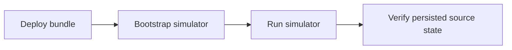

Then validate the analytical pipeline:

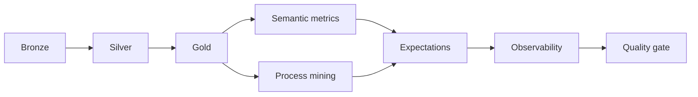

Useful checks:

```sql
SELECT *
FROM `mro_dev`.mro_sim_dev_ephemeral.sim_state;
```

```sql
SHOW TABLES IN `mro_dev`.bronze;
```

```sql
SHOW TABLES IN `mro_dev`.silver;
```

```sql
SHOW TABLES IN `mro_dev`.gold;
```

```sql
SHOW VIEWS IN `mro_dev`.semantic;
```

A key acceptance test is **independent progress**:

1. run `mro_source_simulator` several times without running analytics;
2. confirm operational tables and Delta history advance;
3. run `mro_analytics_pipeline`;
4. confirm Bronze advances its per-table CDC checkpoints;
5. intentionally delay analytics again and verify operational generation remains unaffected.

---

# Development workflow

A practical local development loop is:

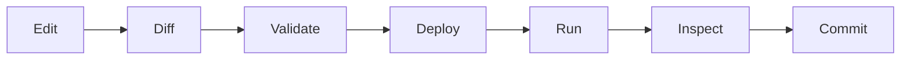

For GitHub-hosted CI/CD, DEV always deploys the single `dev` target and validates against a disposable catalog. PROD alone performs blue-green slot discovery and promotion. The checked-in workflow uses GitHub OIDC workload identity federation for Databricks authentication.

---

</details>

<details>
<summary><strong>Architectural trade-offs</strong></summary>

# Architectural trade-offs

## Why the simulator is not distributed across Spark workers

The operational volume is deliberately small compared with analytical workloads.

The simulator makes state-machine decisions in Python and uses Spark/Delta for durable persistence and downstream processing. Distributing a handful of synthetic work orders across a Spark cluster would add complexity without useful realism.

## Why incrementalization is selective

Bronze consumes source changes incrementally through Delta Change Data Feed. Selected Silver and Gold models also use Delta `MERGE`, while other transformations remain deterministic where a full recomputation is simpler and safer at the current scale.

Event facts are natural incremental candidates because their business keys are stable. Current-state and snapshot models require more care because a later source change can update an existing analytical row rather than append a new one.

## Why semantic modeling is separate from Gold

Gold defines reusable analytical facts and dimensions.

The semantic layer defines business meaning over those models.

Keeping them separate prevents a common failure mode where dimensional tables, aggregates, dashboard logic, and KPI definitions are all mixed into one "final" layer.

---

</details>

<details>
<summary><strong>Example analytical questions</strong></summary>

# Example analytical questions

The project is designed to support questions such as:

### Maintenance

- How many work orders are preventive vs. corrective?
- How long do work orders wait for material?
- Which assets generate the highest estimated material cost?
- What percentage of total maintenance cycle time is material waiting time?

### Inventory

- Which materials generate the largest consumption value?
- How much inventory is currently available by warehouse?
- How often do cycle counts produce adjustments?
- Which material categories have the highest issue volume?

### Procurement

- Which suppliers deliver late most often?
- What is the PO fill rate?
- How common are partial receipts?
- Which suppliers or materials have the largest delivery variance?
- How many purchase orders are on-time-in-full?

### Fiscal and finance

- What fraction of invoices were blocked?
- Which suppliers generate the largest price variances?
- What is the current open or overdue AP amount?
- What is the average number of days to pay suppliers?

### Cross-domain

- How much maintenance delay is associated with material stockouts?
- Which suppliers contribute most to material-related maintenance waiting time?
- How does procurement delivery performance propagate into work-order completion time?

These cross-domain questions are the main reason the source simulator models causal workflows instead of generating unrelated random tables.

---

</details>

<details>
<summary><strong>Troubleshooting</strong></summary>

# Troubleshooting

## `Invalid catalog identifier: 'mro-data'`

Older revisions of the simulator used an overly strict identifier validator.

The current code supports Unity Catalog names containing hyphens by quoting identifiers with backticks.

Use:

```sql
`mro_dev`.mro_sim_dev_ephemeral.sim_state
```

not:

```sql
mro-data.mro_sim.sim_state
```

## `Compute ... does not exist`

If a Job ran on ephemeral Job compute, the compute resource can be removed after the run finishes. This is expected and is not evidence that the notebook explicitly terminated a shared interactive cluster.

The next Job run should load persisted state from Delta and continue with new compute.

## IPython error mentioning `-f ... connection.json`

This occurs when a notebook tries to parse Jupyter kernel arguments with `argparse`.

The current simulator is notebook-native and reads parameters from `dbutils.widgets`, so it should not consume IPython/Jupyter CLI arguments.

## Semantic metric-view task fails

Check:

- Unity Catalog is enabled;
- the executing identity has `USE CATALOG`, `USE SCHEMA`, and the required create/select privileges;
- the runtime supports metric views;
- all Gold tables exist before the semantic task starts.

## Bundle cannot determine the target workspace

Provide the Databricks CLI profile explicitly:

```bash
databricks bundle validate -t dev -p <profile-name>
```

or configure a `workspace.host` / `workspace.profile` mapping for the target in `databricks.yml`.

Do not place secrets directly in the bundle YAML.

---

</details>

# Current hardening status

The formerly planned hardening items are now represented in the bundle: SCD2, incremental MERGE, expectations, row-count/freshness observability, schema-evolution tests, Genie publication, isolated DEV/PROD environments, production service-principal execution, isolated-catalog integration tests, and process-mining models.

The remaining work is primarily **runtime validation in the real Databricks workspaces** and operational tuning of privileges, warehouse sizing, freshness thresholds, and retention policies.

---

<details>
<summary><strong>Official Databricks references</strong></summary>

# Official Databricks references

- Declarative Automation Bundles: https://docs.databricks.com/aws/en/dev-tools/bundles/
- Bundle configuration reference: https://docs.databricks.com/aws/en/dev-tools/bundles/reference
- Bundle CLI commands: https://docs.databricks.com/aws/en/dev-tools/cli/bundle-commands
- Bundle authentication: https://docs.databricks.com/aws/en/dev-tools/bundles/authentication
- Metric views: https://docs.databricks.com/aws/en/uc-semantics/metric-views/create

---

</details>

## Summary

The repository is best understood as four connected systems:

```mermaid
graph LR
    SRC[Operational MRO] --> ING[Incremental ingestion]
    ING --> ANA[Dimensional analytics]
    ANA --> SEM[Governed semantic metrics]
```

with the operational and analytical workloads independently deployed as code through one Databricks Bundle.

The project therefore provides both a realistic synthetic MRO source system and a compact reference architecture in which source generation, data engineering, and semantic analytics have explicit ownership boundaries and independent execution lifecycles.
