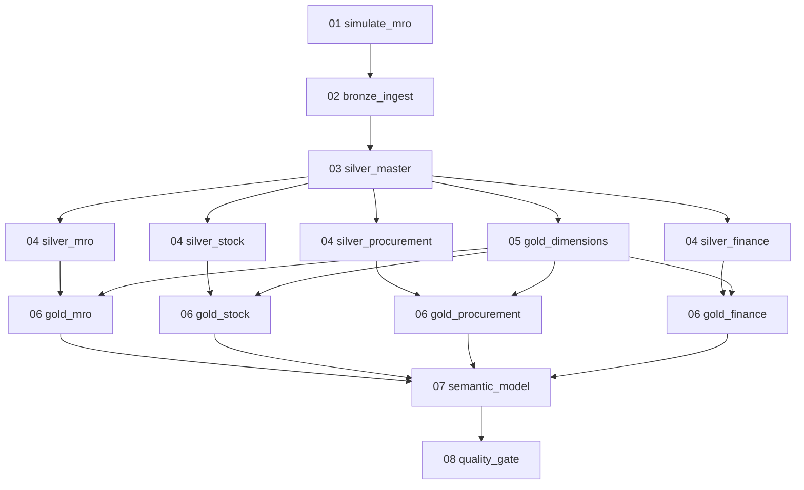

# MRO Data Platform on Databricks

A synthetic **Maintenance, Repair and Operations (MRO)** data platform built to exercise realistic data-engineering patterns on Databricks.

The project does more than generate random rows. It simulates an operational MRO environment with causally related maintenance, inventory, purchasing, receiving, fiscal, and accounts-payable workflows, persists that operational state in Delta Lake, and then processes it through a Bronze → Silver → Gold → Semantic architecture orchestrated as a Databricks Job.

The repository is also a **Job-as-Code** example: the notebooks, task dependencies, runtime parameters, schedule, and deployment targets live together and can be validated, deployed, and executed with Databricks Declarative Automation Bundles.

---

## What this project demonstrates

The project is intentionally designed as a compact laboratory for several data-platform concepts:

- stateful synthetic operational-data generation;
- incremental ingestion using a persisted logical watermark;
- Delta Lake state and event persistence;
- retry-friendly deterministic simulation;
- medallion architecture responsibilities;
- domain-oriented Silver transformations;
- dimensional modeling in Gold;
- Unity Catalog metric views as a semantic layer;
- Databricks multi-task Jobs and DAG dependencies;
- quality gates that can fail the workflow when business invariants are broken;
- Declarative Automation Bundles for Job-as-Code deployment.

It is useful for experimenting with Databricks Jobs, Delta Lake, dimensional modeling, semantic modeling, process mining, data-quality checks, and downstream BI/AI consumers without requiring access to a real ERP.

---

## Business context

The simulated company operates industrial assets and needs to coordinate three strongly related MRO areas:

1. **Maintenance and inventory / warehouse operations**
2. **Procurement and receiving**
3. **Fiscal and accounts payable**

These domains are intentionally connected.

A typical simulated business flow is:

```text
Maintenance demand
      │
      ▼
Work order
      │
      ▼
Material requirement
      │
      ├── stock available ──────► inventory issue ──────► maintenance execution
      │
      └── stock unavailable
               │
               ▼
      Purchase requisition
               │
               ▼
        Purchase order
               │
               ▼
        Goods receipt
          │          │
          ▼          ▼
      Inventory   Fiscal invoice
                     │
                     ▼
                Validation / match
                     │
              ┌──────┴──────┐
              ▼             ▼
           matched        blocked
              │             │
              └──────┬──────┘
                     ▼
              Accounts payable
                     │
                     ▼
                  Payment
```

The resulting data therefore contains useful causal relationships rather than independent synthetic records.

---

## Repository structure

```text
.
├── databricks.yml
├── README.md
├── resources/
│   └── mro_pipeline.job.yml
└── src/
    ├── 01_simulate_mro.py
    ├── 02_bronze_ingest.py
    ├── 03_silver_master.py
    ├── 04_silver_mro.py
    ├── 04_silver_stock.py
    ├── 04_silver_procurement.py
    ├── 04_silver_finance.py
    ├── 05_gold_dimensions.py
    ├── 06_gold_mro.py
    ├── 06_gold_stock.py
    ├── 06_gold_procurement.py
    ├── 06_gold_finance.py
    ├── 07_semantic_model.py
    └── 08_quality_gate.py
```

### Asset inventory

| Asset | Responsibility |
|---|---|
| `databricks.yml` | Bundle root configuration. Defines the bundle name, reusable schema variables, and `dev` / `prod` deployment targets. |
| `resources/mro_pipeline.job.yml` | Complete Databricks Job definition: task DAG, parameters, schedule, queueing, and concurrency. |
| `src/01_simulate_mro.py` | Stateful synthetic MRO source-system simulator backed by Delta tables. |
| `src/02_bronze_ingest.py` | Incremental source-faithful ingestion into Bronze using simulation ticks as watermarks. |
| `src/03_silver_master.py` | Normalizes and conforms supplier, material, asset, warehouse, and cost-center master data. |
| `src/04_silver_mro.py` | Enriches maintenance work orders, material fulfillment, status history, and lifecycle durations. |
| `src/04_silver_stock.py` | Normalizes inventory events and current stock position. |
| `src/04_silver_procurement.py` | Normalizes requisitions, purchase orders, PO items, and goods receipts; derives procurement lead-time attributes. |
| `src/04_silver_finance.py` | Normalizes fiscal invoices, invoice items, accounts payable, and payments. |
| `src/05_gold_dimensions.py` | Builds conformed dimensions and a date dimension. |
| `src/06_gold_mro.py` | Builds dimensional maintenance facts. |
| `src/06_gold_stock.py` | Builds dimensional inventory facts and stock snapshots. |
| `src/06_gold_procurement.py` | Builds purchase-order and goods-receipt facts. |
| `src/06_gold_finance.py` | Builds fiscal, accounts-payable, and payment facts. |
| `src/07_semantic_model.py` | Creates Unity Catalog metric views for governed MRO KPIs. |
| `src/08_quality_gate.py` | Executes cross-layer invariants and fails the Job when critical data-quality rules are violated. |

---

## Databricks catalog layout

The default catalog is:

```text
mro-data
```

Because the catalog contains a hyphen, SQL references must quote it with backticks:

```sql
SELECT *
FROM `mro-data`.gold.fact_work_order;
```

The notebooks already centralize identifier quoting, so the hyphenated catalog name is supported.

The project creates or uses five schemas:

```text
`mro-data`
│
├── mro_sim    # synthetic operational source system
├── bronze     # source-faithful ingestion boundary
├── silver     # normalized, validated, enriched domain models
├── gold       # dimensional analytical models
└── semantic   # governed Unity Catalog metric views
```

### Layer responsibilities

| Layer | Primary responsibility | What should *not* happen here |
|---|---|---|
| `mro_sim` | Simulate source-system behavior and persist operational state/events. | Analytical modeling. |
| Bronze | Preserve source history and ingestion metadata with minimal interpretation. | KPI logic, dimensional modeling, cross-domain business enrichment. |
| Silver | Normalize, validate, conform, and enrich operational-domain data. | Dashboard-specific metrics or arbitrary presentation aggregates. |
| Gold | Publish conformed dimensions and facts at explicit analytical grains. | Re-implement source-system state machines. |
| Semantic | Define reusable business measures and dimensions over Gold. | Duplicate transformation logic that belongs in Silver/Gold. |

---

# 1. Operational source simulator — `01_simulate_mro.py`

The simulator is the source system for the rest of the project. It is intentionally **job-oriented**, not a continuously running service.

Every invocation:

1. loads durable simulation state from Delta;
2. advances one or more logical simulation ticks;
3. generates operational state transitions and events;
4. persists a micro-batch;
5. advances `sim_state.committed_tick` only after the batch is durable;
6. exits.

This means ephemeral Databricks Job compute is safe: the driver can disappear after a successful run because the state needed for the next run is stored in Delta.

## Simulation clock

The important control table is:

```text
mro_sim.sim_state
```

Its main concepts are:

- `simulated_at` — current business/simulation time;
- `committed_tick` — highest fully persisted logical tick;
- `seed` — deterministic random seed;
- `step_minutes` — simulated time advanced per tick;
- `business_timezone` — timezone used for business-calendar behavior.

Example:

```text
run 1   committed_tick 0 → 1
run 2   committed_tick 1 → 2
run 3   committed_tick 2 → 3
```

With:

```text
step_minutes = 60
```

one tick represents one simulated hour.

## Why `committed_tick` exists

A business action can touch several Delta tables. Delta transactions are atomic at a table level, not across an arbitrary set of tables.

The simulator therefore treats `committed_tick` as a visibility boundary:

```text
write state/event rows for tick N
        │
        ▼
flush affected Delta tables
        │
        ▼
advance sim_state.committed_tick to N
```

Downstream ingestion only consumes rows whose simulation tick is at or below the committed source tick.

This prevents the analytical pipeline from intentionally consuming a partially persisted logical simulation interval.

## Determinism and retries

The simulator uses deterministic IDs and a per-tick random seed derived from the configured seed and tick number.

Conceptually:

```text
same seed + same tick + same entity context
                    ↓
            same generated identity
```

This makes replay/retry behavior substantially safer than generating new random identifiers on every Job attempt.

## Operational domains

The simulator maintains master/reference data for:

- suppliers;
- warehouses;
- cost centers;
- assets;
- materials;
- asset/material usage profiles.

It generates transactional behavior for:

- maintenance work orders;
- work-order material demand;
- inventory issues and receipts;
- stock replenishment;
- purchase requisitions;
- purchase orders;
- partial goods receipts;
- fiscal invoices;
- invoice validation and blocking;
- accounts payable;
- payment scheduling and execution;
- cycle-count adjustments.

## Stateful workflows

### Work order

```text
PLANNED
   ↓
RELEASED
   ├───────────────┐
   ▼               │
WAITING_MATERIAL   │
   └──────────────►│
              IN_PROGRESS
                   ↓
               COMPLETED
                   ↓
                 CLOSED
```

### Work-order material

```text
REQUESTED
   ↓
PARTIALLY_ISSUED
   ↓
FULFILLED
```

### Purchase requisition

```text
REQUESTED → APPROVED → ORDERED → CLOSED
```

### Purchase order

```text
APPROVED → SENT → PARTIALLY_RECEIVED → RECEIVED → CLOSED
```

A PO may receive multiple partial receipts before becoming fully received.

### Fiscal invoice

```text
RECEIVED
   ↓
VALIDATING
   ├──────────────► MATCHED ─────► POSTED
   │
   └──► BLOCKED ─► RELEASED ─────► MATCHED
```

### Accounts payable

```text
OPEN → SCHEDULED → PAID
```

## Physical source tables

The simulator distinguishes mutable state from immutable events.

### Master/reference tables

```text
supplier
warehouse
cost_center
asset
material
asset_material_profile
```

### Simulation control

```text
sim_state
simulation_run
```

### Versioned mutable state

```text
stock_balance_state
work_order_state
work_order_material_state
purchase_requisition_state
purchase_order_state
purchase_order_item_state
fiscal_invoice_state
accounts_payable_state
```

Versioned rows use `valid_from_tick`.

### Append/event stores

```text
purchase_requisition_item_store
goods_receipt_store
goods_receipt_item_store
inventory_movement_store
fiscal_invoice_item_store
payment_store
entity_state_transition_store
event_log_store
```

### Source-facing views

The simulator also exposes current committed views such as:

```text
stock_balance
work_order
work_order_material
purchase_requisition
purchase_order
purchase_order_item
fiscal_invoice
accounts_payable
```

and committed event views such as:

```text
inventory_movement
goods_receipt
payment
entity_state_transition
event_log
```

State-history views are also generated for versioned entities.

---

# 2. Bronze ingestion — `02_bronze_ingest.py`

Bronze is the ingestion and replay boundary.

It answers:

> What did the simulated operational source expose?

It deliberately does **not** answer:

> What is the business interpretation of this data?

## Incremental contract

Bronze compares:

```text
mro_sim.sim_state.committed_tick
```

with the persisted per-table watermark in:

```text
bronze.pipeline_watermark
```

Example:

```text
source committed_tick = 483
bronze last_tick       = 480

rows ingested:
481
482
483
```

The watermark is then advanced to `483`.

## Bronze metadata

Ingested data receives ingestion metadata such as:

```text
_bronze_ingested_at
_bronze_run_id
_source_table
_source_committed_tick
```

## Bronze objects

Master/reference snapshots:

```text
supplier_raw
warehouse_raw
cost_center_raw
asset_raw
material_raw
asset_material_profile_raw
sim_state_raw
simulation_run_raw
```

Versioned source state:

```text
stock_balance_state_raw
work_order_state_raw
work_order_material_state_raw
purchase_requisition_state_raw
purchase_order_state_raw
purchase_order_item_state_raw
fiscal_invoice_state_raw
accounts_payable_state_raw
```

Append/event history:

```text
purchase_requisition_item_raw
goods_receipt_raw
goods_receipt_item_raw
inventory_movement_raw
fiscal_invoice_item_raw
payment_raw
entity_state_transition_raw
event_log_raw
```

Control:

```text
pipeline_watermark
```

## Important design choice

**Bronze is currently the physically incremental analytical layer.**

Silver and Gold are deterministic rebuilds from committed Bronze data. This is intentional for the current dataset size: it keeps correctness and explainability high while still exercising a real incremental ingestion boundary.

Incremental `MERGE` strategies can later be introduced selectively for larger Silver/Gold models when the additional state-management complexity is justified.

---

# 3. Silver layer

Silver is organized by business domain.

Its responsibilities include:

- type normalization;
- monetary conversion from cents into decimal currency units;
- tax-rate normalization from basis points into percentages;
- reference joins;
- lifecycle enrichment;
- fulfillment and lead-time calculations;
- referential-integrity checks;
- operational data-quality rules.

Silver keeps operational grains rather than collapsing everything into dashboard aggregates.

## `03_silver_master.py`

Produces conformed reference entities:

```text
silver.supplier
silver.warehouse
silver.cost_center
silver.material
silver.asset
silver.asset_material_profile
```

Examples of normalization:

```text
5800 cents → 58.00 currency units
1800 basis points → 18.00%
```

The notebook also validates important master-data conditions such as duplicate IDs and missing supplier/cost-center references.

## `04_silver_mro.py`

Produces:

```text
silver.work_order_status_history
silver.work_order
silver.work_order_material
silver.work_order_lifecycle
```

Derived lifecycle attributes include:

- planning hours;
- material-wait hours;
- execution hours;
- closure hours;
- total elapsed lifecycle hours;
- material fulfillment ratio;
- estimated issued-material cost;
- whether the work order ever entered `WAITING_MATERIAL`.

This is the main source for maintenance-cycle analysis and for questions such as:

> How much maintenance delay was caused by material availability?

## `04_silver_stock.py`

Produces:

```text
silver.inventory_movement
silver.stock_position
```

Enrichment includes:

- movement direction (`IN`, `OUT`, `ZERO`);
- normalized unit cost;
- inventory-movement value;
- material and warehouse context;
- current available quantity;
- reorder information;
- current inventory value.

The notebook rejects negative on-hand or reserved quantities.

## `04_silver_procurement.py`

Produces:

```text
silver.purchase_requisition
silver.purchase_requisition_item
silver.purchase_order
silver.purchase_order_item
silver.goods_receipt
silver.goods_receipt_item
```

Derived procurement attributes include:

- requisition approval lead time;
- PO dispatch lead time;
- promised vs. received delivery variance;
- on-time-delivery flag;
- open quantity;
- fill ratio;
- ordered value;
- received value;
- partial-receipt behavior.

The notebook validates that received quantities never exceed ordered quantities.

## `04_silver_finance.py`

Produces:

```text
silver.fiscal_invoice
silver.fiscal_invoice_item
silver.accounts_payable
silver.payment
```

Enrichment includes:

- normalized monetary values;
- invoice price variance percentage;
- whether an invoice was ever blocked;
- tax amounts;
- AP days-to-pay;
- overdue status;
- days past due.

---

# 4. Gold dimensional model

Gold switches intentionally from operational modeling to analytical dimensional modeling.

## `05_gold_dimensions.py`

Creates the conformed dimensions:

```text
gold.dim_date
gold.dim_supplier
gold.dim_material
gold.dim_warehouse
gold.dim_cost_center
gold.dim_asset
```

Surrogate analytical keys are deterministic `BIGINT` hashes of durable source IDs.

The date dimension follows the simulated business horizon rather than the wall-clock date on which the Databricks Job happens to execute.

## `06_gold_mro.py`

Creates:

```text
gold.fact_work_order
gold.fact_work_order_material
```

Primary grains:

```text
fact_work_order          = one row per work order
fact_work_order_material = one row per work-order/material requirement
```

## `06_gold_stock.py`

Creates:

```text
gold.fact_inventory_movement
gold.fact_stock_position
```

Primary grains:

```text
fact_inventory_movement = one row per inventory movement
fact_stock_position      = one row per material × warehouse at the current simulation snapshot
```

## `06_gold_procurement.py`

Creates:

```text
gold.fact_purchase_order_item
gold.fact_goods_receipt_item
```

Primary grains:

```text
fact_purchase_order_item = one row per purchase-order item
fact_goods_receipt_item  = one row per goods-receipt item
```

The PO-item fact includes useful supplier-performance attributes such as:

- ordered / received quantity;
- fill ratio;
- delivery variance;
- partial receipt;
- on-time-in-full indicator.

## `06_gold_finance.py`

Creates:

```text
gold.fact_fiscal_invoice
gold.fact_fiscal_invoice_item
gold.fact_accounts_payable
gold.fact_payment
```

Primary grains remain explicit: invoice, invoice item, payable title, and payment.

---

# 5. Semantic layer — `07_semantic_model.py`

The semantic layer creates Unity Catalog **metric views** using `CREATE OR REPLACE VIEW ... WITH METRICS LANGUAGE YAML`.

It intentionally sits above Gold so reusable business definitions do not leak into raw ingestion or domain normalization.

The project currently defines five metric views.

## `semantic.maintenance_metrics`

Dimensions include:

- planned date;
- maintenance type;
- priority;
- status;
- asset type;
- asset criticality;
- cost center.

Measures include:

```text
work_order_count
completed_work_order_count
corrective_work_order_count
estimated_material_cost
avg_material_wait_hours
avg_execution_hours
avg_cycle_hours
material_wait_ratio
```

## `semantic.inventory_metrics`

Measures include:

```text
movement_count
issued_quantity
received_quantity
net_quantity
net_movement_value
adjustment_quantity
```

## `semantic.procurement_metrics`

Measures include:

```text
purchase_order_count
purchase_order_item_count
ordered_value
ordered_quantity
received_quantity
fill_rate
avg_delivery_variance_hours
late_purchase_order_count
otif_purchase_order_count
partial_line_count
```

## `semantic.invoice_metrics`

Measures include:

```text
invoice_count
invoice_value
blocked_invoice_count
blocked_invoice_rate
avg_abs_price_variance_pct
tax_issue_count
```

## `semantic.payables_metrics`

Measures include:

```text
payable_count
payable_amount
open_amount
paid_amount
overdue_amount
overdue_count
avg_days_to_pay
```

Metric views require Unity Catalog and a Databricks runtime / SQL environment that supports metric views.

---

# 6. Quality gate — `08_quality_gate.py`

The final notebook is deliberately a **hard gate**, not a passive report.

If an invariant fails, the notebook raises an exception and the Job run fails.

Current checks include:

```text
negative_stock
work_order_material_overissue
purchase_order_overreceipt
paid_ap_without_paid_at
orphan_gold_work_order_asset
orphan_gold_inventory_material
duplicate_gold_material_key
watermark_ahead_of_source
```

This means a green Job run communicates more than "the notebooks executed". It also means the core cross-layer invariants passed.

---

# Job DAG

The full Job is declared in:

```text
resources/mro_pipeline.job.yml
```

The effective dependency graph is:



The fan-out is intentional:

- all domain Silver notebooks depend on conformed master data;
- Gold dimensions can be built in parallel with the domain Silver notebooks;
- each Gold fact notebook waits only for its required Silver domain plus Gold dimensions;
- the semantic task waits for all Gold facts;
- the quality gate runs last.

---

# Job execution behavior

The Job is configured with:

```text
max_concurrent_runs = 1
queue.enabled       = true
```

The single-concurrent-run constraint is important because the simulator behaves as a single logical writer advancing the persisted simulation clock.

The bundle also declares an hourly schedule:

```text
0 0 * * * ?
America/Sao_Paulo
```

but ships with:

```text
pause_status = PAUSED
```

This prevents a newly deployed development bundle from immediately starting periodic execution.

The Job YAML does not pin an explicit cluster. This setup assumes the target workspace supports the intended serverless Job execution mode. If that is not available for the workspace/task combination, add an explicit Job cluster or another supported compute definition before deployment.

---

# Parameters

The Job defines shared parameters once and passes them to Notebook tasks as Databricks widgets.

## Data-platform parameters

| Parameter | Default | Meaning |
|---|---:|---|
| `catalog` | `mro-data` | Unity Catalog catalog containing the project schemas. |
| `source_schema` | `mro_sim` | Synthetic operational source schema. |
| `bronze_schema` | `bronze` | Bronze ingestion schema. |
| `silver_schema` | `silver` | Silver normalization/enrichment schema. |
| `gold_schema` | `gold` | Gold dimensional schema. |
| `semantic_schema` | `semantic` | Semantic metric-view schema. |

## Simulator parameters

| Parameter | Default | Meaning |
|---|---:|---|
| `start` | `2026-01-01T08:00:00-03:00` | Initial simulation timestamp. |
| `step_minutes` | `60` | Simulated minutes advanced per tick. |
| `ticks_per_run` | `1` | Number of ticks executed by each simulator Job invocation. |
| `commit_every_ticks` | `1` | Maximum ticks between durable simulation flushes. |
| `seed` | `42` | Base deterministic random seed. |
| `work_orders_per_day` | `8` | Approximate synthetic work-order generation rate. |
| `cycle_counts_per_day` | `3` | Approximate inventory cycle-count rate. |
| `business_timezone` | `America/Sao_Paulo` | Business-calendar timezone. |
| `bootstrap_only` | `false` | Create/initialize simulator structures without advancing simulation time. |
| `reset` | `false` | Reset simulator structures/state before running. Use carefully. |

Example accelerated run:

```text
ticks_per_run = 24
step_minutes  = 60
```

advances approximately one simulated day per Job execution.

---

# Bundle configuration — `databricks.yml`

`databricks.yml` is the bundle entry point.

It defines:

- bundle name: `mro-data-pipeline`;
- resource includes: `resources/*.yml`;
- schema variables;
- a default `dev` target in development mode;
- a `prod` target in production mode.

The checked-in file intentionally does not contain credentials.

For attended local development, authenticate the Databricks CLI with OAuth and select a CLI profile. For unattended CI/CD, prefer a service-principal/OAuth M2M configuration rather than storing user credentials in the repository.

---

# Prerequisites

You need:

- a Databricks workspace;
- Unity Catalog access;
- permissions to use the target catalog and create/use the configured schemas and objects;
- a modern Databricks CLI with Declarative Automation Bundle support;
- an authenticated CLI profile or equivalent unified-authentication configuration;
- a runtime / SQL environment that supports Unity Catalog metric views for the semantic task.

The semantic notebook uses metric views, whose `WITH METRICS` syntax is supported in Unity Catalog on Databricks Runtime 16.4+; newer metric-view features can require newer runtimes.

---

# Authentication

Create an attended OAuth profile:

```bash
databricks auth login \
  --host https://<your-workspace-host>
```

Then list profiles:

```bash
databricks auth profiles
```

Verify a specific profile:

```bash
databricks current-user me \
  --profile <profile-name>
```

## WSL note

If the CLI runs inside WSL while the browser runs on Windows, the OAuth callback to `http://localhost:8020` can occasionally become awkward because "localhost" may resolve in a different network context.

If authentication succeeds in the browser but the callback page keeps loading:

1. confirm whether the CLI already saved the profile;
2. inspect the WSL listener with `ss -ltnp | grep 8020`;
3. retry authentication rather than reusing an old OAuth callback URL;
4. if necessary, complete a fresh callback from the same WSL network context or run the Databricks CLI from Windows.

Never commit OAuth codes, access tokens, or client secrets to the repository.

---

# Validate the bundle

From the repository root:

```bash
databricks bundle validate \
  -t dev \
  -p <profile-name>
```

Useful inspection command:

```bash
databricks bundle summary \
  -t dev \
  -p <profile-name>
```

Validation checks the bundle configuration before resources are deployed.

---

# Deploy

```bash
databricks bundle deploy \
  -t dev \
  -p <profile-name>
```

Deployment uploads the notebook sources and creates or updates the Databricks Job described by the bundle.

The development target uses Databricks' development deployment mode, so deployed resource names may receive a development prefix associated with the deploying identity.

---

# Run

Run the complete Job:

```bash
databricks bundle run \
  -t dev \
  -p <profile-name> \
  mro_data_pipeline
```

Override Job-level parameters:

```bash
databricks bundle run \
  -t dev \
  -p <profile-name> \
  --params ticks_per_run=24,step_minutes=60 \
  mro_data_pipeline
```

Bootstrap the simulator without advancing ticks:

```bash
databricks bundle run \
  -t dev \
  -p <profile-name> \
  --params bootstrap_only=true \
  mro_data_pipeline
```

Databricks CLI can also run only selected Job tasks. That is useful during development when validating one branch of the DAG rather than executing the whole workflow.

For example, consult `databricks bundle run --help` for the `--only` syntax supported by your installed CLI version.

---

# Recommended first deployment sequence

Do not debug the entire DAG at once on a new workspace.

A safer progression is:

```text
1. simulate_mro
2. bronze_ingest
3. silver_master
4. four domain Silver tasks
5. gold_dimensions
6. Gold fact tasks
7. semantic_model
8. quality_gate
```

After each stage, inspect the created schema and a few representative records.

Useful checks:

```sql
SELECT *
FROM `mro-data`.mro_sim.sim_state;
```

```sql
SHOW TABLES IN `mro-data`.bronze;
```

```sql
SHOW TABLES IN `mro-data`.silver;
```

```sql
SHOW TABLES IN `mro-data`.gold;
```

```sql
SHOW VIEWS IN `mro-data`.semantic;
```

The most important simulator acceptance test is that independent executions advance persisted state rather than restarting it:

```text
run 1 → committed_tick = 1
run 2 → committed_tick = 2
run 3 → committed_tick = 3
```

---

# Development workflow

A practical local development loop is:

```text
edit notebook / YAML
        ↓
git diff
        ↓
databricks bundle validate
        ↓
databricks bundle deploy
        ↓
databricks bundle run
        ↓
inspect Delta objects / Job run
        ↓
git commit
```

For production CI/CD, replace the attended user login with a service principal and OAuth machine-to-machine authentication.

---

# Architectural trade-offs

## Why the simulator is not distributed across Spark workers

The operational volume is deliberately small compared with analytical workloads.

The simulator makes state-machine decisions in Python and uses Spark/Delta for durable persistence and downstream processing. Distributing a handful of synthetic work orders across a Spark cluster would add complexity without useful realism.

## Why Bronze is incremental but Silver/Gold rebuild today

For this dataset size, full deterministic Silver/Gold rebuilds are simpler to reason about and easier to validate.

The current design therefore exercises a realistic incremental ingestion boundary without prematurely introducing watermark and merge state into every analytical model.

If scale becomes meaningful, good candidates for incrementalization are:

- `silver.inventory_movement`;
- `silver.work_order_status_history`;
- `gold.fact_inventory_movement`;
- `gold.fact_goods_receipt_item`;
- `gold.fact_fiscal_invoice_item`;
- `gold.fact_payment`.

Current-state/snapshot models require more care because updates can change an existing analytical row rather than simply append a new one.

## Why semantic modeling is separate from Gold

Gold defines reusable analytical facts and dimensions.

The semantic layer defines business meaning over those models.

Keeping them separate prevents a common failure mode where dimensional tables, aggregates, dashboard logic, and KPI definitions are all mixed into one "final" layer.

---

# Example analytical questions

The project is designed to support questions such as:

### Maintenance

- How many work orders are preventive vs. corrective?
- How long do work orders wait for material?
- Which assets generate the highest estimated material cost?
- What percentage of total maintenance cycle time is material waiting time?

### Inventory

- Which materials generate the largest consumption value?
- How much inventory is currently available by warehouse?
- How often do cycle counts produce adjustments?
- Which material categories have the highest issue volume?

### Procurement

- Which suppliers deliver late most often?
- What is the PO fill rate?
- How common are partial receipts?
- Which suppliers or materials have the largest delivery variance?
- How many purchase orders are on-time-in-full?

### Fiscal and finance

- What fraction of invoices were blocked?
- Which suppliers generate the largest price variances?
- What is the current open or overdue AP amount?
- What is the average number of days to pay suppliers?

### Cross-domain

- How much maintenance delay is associated with material stockouts?
- Which suppliers contribute most to material-related maintenance waiting time?
- How does procurement delivery performance propagate into work-order completion time?

These cross-domain questions are the main reason the source simulator models causal workflows instead of generating unrelated random tables.

---

# Troubleshooting

## `Invalid catalog identifier: 'mro-data'`

Older revisions of the simulator used an overly strict identifier validator.

The current code supports Unity Catalog names containing hyphens by quoting identifiers with backticks.

Use:

```sql
`mro-data`.mro_sim.sim_state
```

not:

```sql
mro-data.mro_sim.sim_state
```

## `Compute ... does not exist`

If a Job ran on ephemeral Job compute, the compute resource can be removed after the run finishes. This is expected and is not evidence that the notebook explicitly terminated a shared interactive cluster.

The next Job run should load persisted state from Delta and continue with new compute.

## IPython error mentioning `-f ... connection.json`

This occurs when a notebook tries to parse Jupyter kernel arguments with `argparse`.

The current simulator is notebook-native and reads parameters from `dbutils.widgets`, so it should not consume IPython/Jupyter CLI arguments.

## Semantic metric-view task fails

Check:

- Unity Catalog is enabled;
- the executing identity has `USE CATALOG`, `USE SCHEMA`, and the required create/select privileges;
- the runtime supports metric views;
- all Gold tables exist before the semantic task starts.

## Bundle cannot determine the target workspace

Provide the Databricks CLI profile explicitly:

```bash
databricks bundle validate -t dev -p <profile-name>
```

or configure a `workspace.host` / `workspace.profile` mapping for the target in `databricks.yml`.

Do not place secrets directly in the bundle YAML.

---

# Production hardening opportunities

This project is intentionally educational, but its structure makes several next steps possible:

- introduce SCD Type 2 behavior for selected conformed dimensions;
- convert selected Silver/Gold tables to incremental `MERGE` pipelines;
- add expectations / declarative data-quality tooling;
- add row-count and freshness observability;
- add schema-evolution tests;
- publish semantic metrics to dashboards or Genie;
- add CI validation for Python syntax and bundle configuration;
- deploy `dev`, `staging`, and `prod` to separate workspaces/catalogs;
- run production deployment with a service principal rather than a developer identity;
- add automated integration tests against an isolated catalog/schema;
- add process-mining models over `entity_state_transition`.

---

# Official Databricks references

- Declarative Automation Bundles: https://docs.databricks.com/aws/en/dev-tools/bundles/
- Bundle configuration reference: https://docs.databricks.com/aws/en/dev-tools/bundles/reference
- Bundle CLI commands: https://docs.databricks.com/aws/en/dev-tools/cli/bundle-commands
- Bundle authentication: https://docs.databricks.com/aws/en/dev-tools/bundles/authentication
- Metric views: https://docs.databricks.com/aws/en/uc-semantics/metric-views/create

---

## Summary

The repository is best understood as four connected systems:

```text
Synthetic operational MRO system
              │
              ▼
Incremental/replayable ingestion
              │
              ▼
Normalized + dimensional analytics
              │
              ▼
Governed semantic metrics
```

with the entire execution graph deployed as code through a Databricks Bundle.

The project therefore provides both a realistic synthetic MRO dataset and a compact reference architecture for building, orchestrating, validating, and deploying a Databricks analytical workflow.
